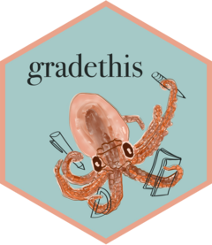
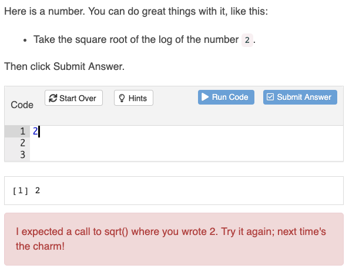

# gradethis <a href='https://pkgs.rstudio.com/gradethis'></a>

<!-- badges: start -->
[](https://CRAN.R-project.org/package=gradethis)
[](https://github.com/rstudio/gradethis/actions)
[](https://codecov.io/gh/rstudio/gradethis?branch=master)
[](http://www.rpackages.io/package/gradethis)
[](https://zenodo.org/badge/latestdoi/126734088)
<!-- badges: end -->

gradethis helps scale feedback for [learnr] exercises. Instructors can use a model solution as a template or write highly customized testing logic to provide specific feedback for common mistakes.

gradethis is designed for use in [learnr] tutorials. We recommend that you first be comfortable writing learnr tutorials before you begin incorporating exercise feedback with gradethis. You can learn more about learnr tutorials with the [learnr package documentation][learnr].



## Installation

gradethis is still in development and not on [CRAN](https://CRAN.R-project.org) yet.
The development version of gradethis can be installed from GitHub with:

```r
# install.packages("remotes")
remotes::install_github("rstudio/gradethis")
```

## Usage

To use gradethis in a learnr tutorial, start by loading gradethis after learnr in the `setup` chunk of your tutorial:

````markdown
```{r setup}
library(learnr)
library(gradethis)
```
````

gradethis provides two grading modalities. You can:

1. Compare student code to model solution code with `grade_this_code()`, or

1. Write custom grading logic with `grade_this()`.

Learn more about where and how to write exercise-checking code in `vignette("gradethis")`.

## Getting help

[![RStudio Community: Teaching](https://img.shields.io/badge/Community%20Support-Teaching-75aadb.svg?style=popout&logo=data:image/svg+xml;base64,PD94bWwgdmVyc2lvbj0iMS4wIiBlbmNvZGluZz0idXRmLTgiPz4KPCEtLSBHZW5lcmF0b3I6IEFkb2JlIElsbHVzdHJhdG9yIDIyLjEuMCwgU1ZHIEV4cG9ydCBQbHVnLUluIC4gU1ZHIFZlcnNpb246IDYuMDAgQnVpbGQgMCkgIC0tPgo8c3ZnIHZlcnNpb249IjEuMSIgeG1sbnM9Imh0dHA6Ly93d3cudzMub3JnLzIwMDAvc3ZnIiB4bWxuczp4bGluaz0iaHR0cDovL3d3dy53My5vcmcvMTk5OS94bGluayIgeD0iMHB4IiB5PSIwcHgiCgkgdmlld0JveD0iMCAwIDYyNS45IDYyNS45IiBzdHlsZT0iZW5hYmxlLWJhY2tncm91bmQ6bmV3IDAgMCA2MjUuOSA2MjUuOTsiIHhtbDpzcGFjZT0icHJlc2VydmUiPgo8c3R5bGUgdHlwZT0idGV4dC9jc3MiPgoJLnN0MHtmaWxsOiM3NUFBREI7fQoJLnN0MXtmaWxsOiM0RDRENEQ7fQoJLnN0MntmaWxsOiNGRkZGRkY7fQoJLnN0M3tmaWxsOnVybCgjU1ZHSURfMV8pO30KCS5zdDR7ZmlsbDp1cmwoI1NWR0lEXzJfKTt9Cgkuc3Q1e2ZpbGw6dXJsKCNTVkdJRF8zXyk7fQoJLnN0NntmaWxsOnVybCgjU1ZHSURfNF8pO30KCS5zdDd7ZmlsbDp1cmwoI1NWR0lEXzVfKTt9Cgkuc3Q4e2ZpbGw6dXJsKCNTVkdJRF82Xyk7fQoJLnN0OXtmaWxsOnVybCgjU1ZHSURfN18pO30KCS5zdDEwe2ZpbGw6dXJsKCNTVkdJRF84Xyk7fQoJLnN0MTF7ZmlsbDp1cmwoI1NWR0lEXzlfKTt9Cgkuc3QxMntmaWxsOnVybCgjU1ZHSURfMTBfKTt9Cgkuc3QxM3tvcGFjaXR5OjAuMTg7ZmlsbDp1cmwoI1NWR0lEXzExXyk7fQoJLnN0MTR7b3BhY2l0eTowLjM7fQo8L3N0eWxlPgo8ZyBpZD0iR3JheV9Mb2dvIj4KPC9nPgo8ZyBpZD0iQmxhY2tfTGV0dGVycyI+CjwvZz4KPGcgaWQ9IkJsdWVfR3JhZGllbnRfTGV0dGVycyI+Cgk8Zz4KCgkJCTxlbGxpcHNlIHRyYW5zZm9ybT0ibWF0cml4KDAuNzA3MSAtMC43MDcxIDAuNzA3MSAwLjcwNzEgLTEyNy45MjY1IDMxNy4wMzE3KSIgY2xhc3M9InN0MCIgY3g9IjMxOC43IiBjeT0iMzEyLjkiIHJ4PSIzMDkuOCIgcnk9IjMwOS44Ii8+CgkJPGc+CgkJCTxwYXRoIGNsYXNzPSJzdDIiIGQ9Ik00MjQuNyw0MTEuOGgzMy42djI2LjFoLTUxLjNMMzIyLDMxMC41aC00NS4zdjEwMS4zaDQ0LjN2MjYuMUgyMDkuNXYtMjYuMWgzOC4zVjE4Ny4zbC0zOC4zLTQuN3YtMjQuNwoJCQkJYzE0LjUsMy4zLDI3LjEsNS42LDQyLjksNS42YzIzLjgsMCw0OC4xLTUuNiw3MS45LTUuNmM0Ni4yLDAsODkuMSwyMSw4OS4xLDcyLjNjMCwzOS43LTIzLjgsNjQuOS02MC43LDc1LjZMNDI0LjcsNDExLjh6CgkJCQkgTTI3Ni43LDI4NS4zbDI0LjMsMC41YzU5LjMsMC45LDgyLjEtMjEuOSw4Mi4xLTUyLjNjMC0zNS41LTI1LjctNDkuNS01OC4zLTQ5LjVjLTE1LjQsMC0zMS4zLDEuNC00OC4xLDMuM1YyODUuM3oiLz4KCQk8L2c+Cgk8L2c+CjwvZz4KPGcgaWQ9IldoaXRlX0xldHRlcnMiPgo8L2c+CjxnIGlkPSJSX0JhbGwiPgo8L2c+Cjwvc3ZnPg==)](https://community.rstudio.com/c/teaching)
[![RStudio Ask a question: gradethis](https://img.shields.io/badge/Ask%20a%20question-gradethis-75aadb.svg?style=popout&logo=data:image/svg+xml;base64,PHN2ZyB4bWxucz0iaHR0cDovL3d3dy53My5vcmcvMjAwMC9zdmciIHhtbG5zOnhsaW5rPSJodHRwOi8vd3d3LnczLm9yZy8xOTk5L3hsaW5rIiB2ZXJzaW9uPSIxLjEiIHg9IjBweCIgeT0iMHB4IiB2aWV3Qm94PSIwIDAgNjI1LjkgNjI1LjkiIHN0eWxlPSJlbmFibGUtYmFja2dyb3VuZDpuZXcgMCAwIDYyNS45IDYyNS45OyIgeG1sOnNwYWNlPSJwcmVzZXJ2ZSI+CjxzdHlsZSB0eXBlPSJ0ZXh0L2NzcyI+Cgkuc3Qwe2ZpbGw6Izc1QUFEQjt9Cgkuc3Qxe2ZpbGw6IzRENEQ0RDt9Cgkuc3Qye2ZpbGw6I0ZGRkZGRjt9Cgkuc3Qze2ZpbGw6dXJsKCNTVkdJRF8xXyk7fQoJLnN0NHtmaWxsOnVybCgjU1ZHSURfMl8pO30KCS5zdDV7ZmlsbDp1cmwoI1NWR0lEXzNfKTt9Cgkuc3Q2e2ZpbGw6dXJsKCNTVkdJRF80Xyk7fQoJLnN0N3tmaWxsOnVybCgjU1ZHSURfNV8pO30KCS5zdDh7ZmlsbDp1cmwoI1NWR0lEXzZfKTt9Cgkuc3Q5e2ZpbGw6dXJsKCNTVkdJRF83Xyk7fQoJLnN0MTB7ZmlsbDp1cmwoI1NWR0lEXzhfKTt9Cgkuc3QxMXtmaWxsOnVybCgjU1ZHSURfOV8pO30KCS5zdDEye2ZpbGw6dXJsKCNTVkdJRF8xMF8pO30KCS5zdDEze29wYWNpdHk6MC4xODtmaWxsOnVybCgjU1ZHSURfMTFfKTt9Cgkuc3QxNHtvcGFjaXR5OjAuMzt9Cjwvc3R5bGU+CjxnIGlkPSJHcmF5X0xvZ28iPgo8L2c+CjxnIGlkPSJCbGFja19MZXR0ZXJzIj4KPC9nPgo8ZyBpZD0iQmx1ZV9HcmFkaWVudF9MZXR0ZXJzIj4KCTxnPgoKCQkJPGVsbGlwc2UgdHJhbnNmb3JtPSJtYXRyaXgoMC43MDcxIC0wLjcwNzEgMC43MDcxIDAuNzA3MSAtMTI3LjkyNjUgMzE3LjAzMTcpIiBjbGFzcz0ic3QwIiBjeD0iMzE4LjciIGN5PSIzMTIuOSIgcng9IjMwOS44IiByeT0iMzA5LjgiLz4KCQk8Zz4KCQkJPHBhdGggY2xhc3M9InN0MiIgZD0iTTQyNC43LDQxMS44aDMzLjZ2MjYuMWgtNTEuM0wzMjIsMzEwLjVoLTQ1LjN2MTAxLjNoNDQuM3YyNi4xSDIwOS41di0yNi4xaDM4LjNWMTg3LjNsLTM4LjMtNC43di0yNC43ICAgICBjMTQuNSwzLjMsMjcuMSw1LjYsNDIuOSw1LjZjMjMuOCwwLDQ4LjEtNS42LDcxLjktNS42YzQ2LjIsMCw4OS4xLDIxLDg5LjEsNzIuM2MwLDM5LjctMjMuOCw2NC45LTYwLjcsNzUuNkw0MjQuNyw0MTEuOHogICAgICBNMjc2LjcsMjg1LjNsMjQuMywwLjVjNTkuMywwLjksODIuMS0yMS45LDgyLjEtNTIuM2MwLTM1LjUtMjUuNy00OS41LTU4LjMtNDkuNWMtMTUuNCwwLTMxLjMsMS40LTQ4LjEsMy4zVjI4NS4zeiIvPgoJCTwvZz4KCTwvZz4KPC9nPgo8ZyBpZD0iV2hpdGVfTGV0dGVycyI+CjwvZz4KPGcgaWQ9IlJfQmFsbCI+CjwvZz4KPC9zdmc+)](https://community.rstudio.com/new-topic?title=&category_id=13&tags=gradethis&body=%0A%0A%0A%20%20--------%0A%20%20%0A%20%20%3Csup%3EReferred%20here%20by%20%60gradethis%60%27s%20README%3C/sup%3E%0A)

There are two main places to get help:

1. The [gradethis tag on RStudio Community](https://community.rstudio.com/tag/gradethis) is a friendly place to ask any questions about gradethis and the R Markdown family of packages. Additionally, we invite instructors to join the [Teaching Category on RStudio Community](https://community.rstudio.com/c/teaching), where any discussions about teaching are welcome.

1. [Stack Overflow](https://stackoverflow.com/questions/tagged/gradethis) can be a source of answers to common gradethis questions. It is also a great place to get help, once you have created a [reproducible example](https://reprex.tidyverse.org) that illustrates your problem.

## Code of Conduct

<!-- TODO FIX URL -->

Please note that the gradethis project is released with a [Contributor Code of Conduct](https://friendly-golick-0771f8.netlify.app/CODE_OF_CONDUCT.html). By contributing to this project, you agree to abide by its terms.


[learnr]: https://rstudio.github.io/learnr/
